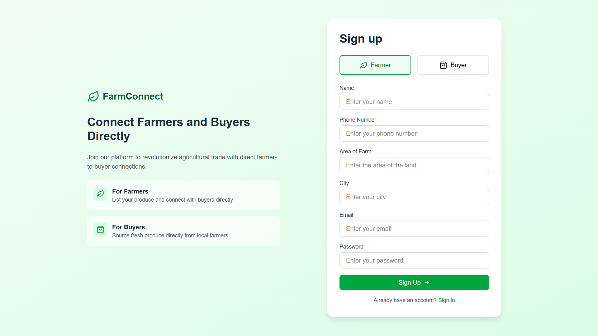
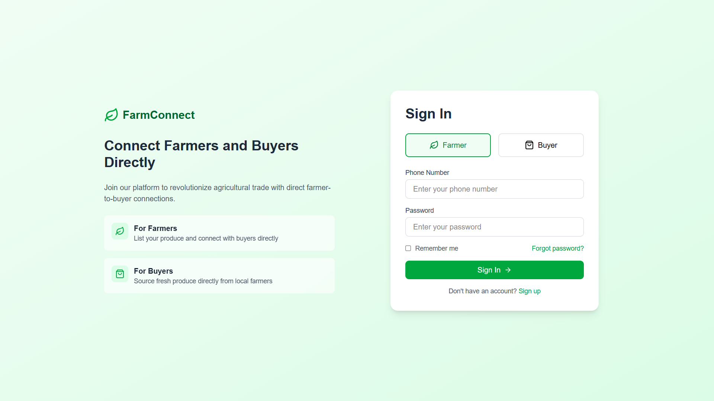
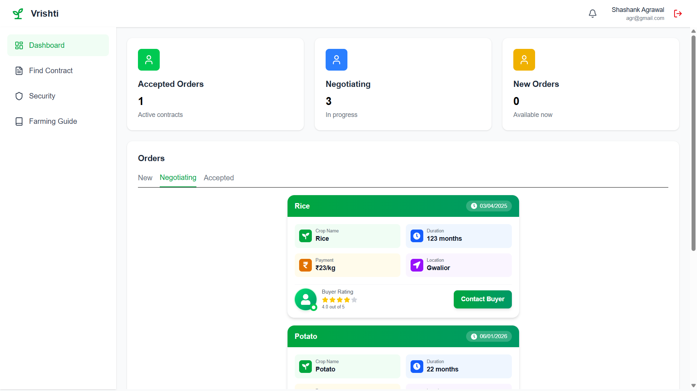
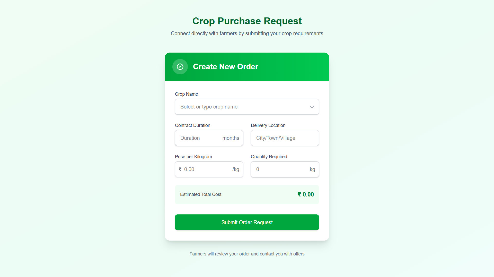

# Vedavik 🌾
> A Next.js marketplace connecting farmers directly with buyers. Eliminate middlemen, negotiate fair prices, and support sustainable agriculture.


---

## 🌟 What is Vedavik?

Veda is a digital marketplace that **eliminates middlemen** and connects farmers directly with buyers. Get fair prices, transparent transactions, and direct communication - all in one platform.

**Key Benefits:**
- 👨‍🌾 **For Farmers**: Sell directly, earn more, no commission cuts
- 🛒 **For Buyers**: Source fresh produce, negotiate prices, ensure quality
- 💬 **Direct Chat**: Real-time communication between both parties
- 💰 **Secure Payments**: Razorpay integration with complete transparency

---

## 👨‍🌾 Complete Farmer Journey

### Step 1: Sign Up
**Page:** `/Farmersignup`



Create your farmer account with:
- Farm details (name, location, size)
- Crops you grow
- Contact information
- Secure password

---

### Step 2: Login
**Page:** `/Farmerlogin`



Access your account securely:
- Email and password authentication
- JWT token-based security
- Redirected to your personal dashboard

---

### Step 3: View Dashboard
**Page:** `/Farmerdashboard`



Your command center shows:
- **Pending Orders**: New requests from buyers
- **Accepted Orders**: Orders you've confirmed
- **Completed Orders**: Your sales history
- **Revenue Statistics**: Track your earnings
- **Quick Actions**: Navigate to order list or chat

**What you can do:**
- View incoming order notifications
- Check order details at a glance
- Access all orders with one click
- Monitor your farm's performance

---

### Step 4: Manage Orders
**Page:** `/Farmerorderlist`


See all incoming orders with complete details:
- **Buyer Information**: Name, location, contact
- **Crop Requirements**: Type, quantity, quality grade
- **Price Range**: Buyer's expected budget
- **Delivery Timeline**: When they need it
- **Order Status**: Pending/Accepted/Completed

**Actions available:**
- Review order specifications
- Click to open chat with buyer
- Accept or decline orders
- Filter by crop type or status

---

### Step 5: Negotiate via Chat
**Page:** `/Chating`


Direct communication with buyers:
- Discuss price and finalize amount
- Clarify quality requirements
- Agree on delivery terms
- Share crop condition details
- Build trust through conversation

**Chat Features:**
- Real-time messaging
- Order context always visible
- Complete message history
- Linked to specific order

---

### Step 6: Accept & Fulfill
**Process Flow:**

1. **Accept Order**: Confirm the deal from your dashboard
2. **Await Payment**: Buyer completes payment via Razorpay
3. **Payment Confirmation**: You receive notification
4. **Prepare Crops**: Get the order ready for delivery
5. **Deliver**: Fulfill the order as agreed
6. **Complete**: Mark order as delivered

**Payment Security:**
- Funds secured through Razorpay
- Released after confirmation
- Complete transaction transparency

---

## 🛒 Complete Buyer Journey

### Step 1: Sign Up
**Page:** `/Buyersignup`


Register as a buyer with:
- Personal or business name
- Delivery address details
- Contact information
- Account credentials

---

### Step 2: Login
**Page:** `/Buyerlogin`


Secure access to your account:
- Email and password login
- JWT authentication
- Direct access to dashboard

---

### Step 3: View Dashboard
**Page:** `/Buyerdashboard`


Your buyer control panel displays:
- **Active Orders**: Orders in progress
- **Pending Requests**: Awaiting farmer response
- **Order History**: Past purchases
- **Spending Summary**: Budget tracking
- **Quick Create**: Start new order instantly

**Dashboard features:**
- Visual order status indicators
- Recent activity feed
- Saved farmer contacts
- Quick navigation menu

---

### Step 4: Create Order
**Page:** `/Createorder`



Submit your requirements with detailed form:

**Order Details to Specify:**
- **Crop Type**: Wheat, rice, vegetables, fruits, pulses, etc.
- **Quantity**: Amount needed (kg/quintal/ton)
- **Quality Grade**: Premium, standard, or economy
- **Expected Price**: Your budget per unit
- **Delivery Date**: When you need it delivered
- **Delivery Location**: Confirm shipping address
- **Special Requirements**: Organic, pesticide-free, certifications needed

**What happens next:**
- Order is saved to database
- Matching farmers are notified
- Order appears in their list
- You can track responses

---

### Step 5: Track Orders
**Page:** `/Buyerorderlist`


Monitor all your orders in one place:

**Order Status Types:**
- 🟡 **Pending**: Waiting for farmer to respond
- 🔵 **In Discussion**: Negotiation happening
- 🟢 **Accepted**: Farmer confirmed the order
- 🟠 **Payment Pending**: Ready to pay
- ✅ **Completed**: Delivered successfully

**Order Information Displayed:**
- Farmer name and farm location
- Crop type and quantity
- Agreed price
- Expected delivery date
- Current status
- Chat access button

---

### Step 6: Negotiate & Confirm
**Page:** `/Chating`


When a farmer responds, start the conversation:

**Discussion Points:**
- Price negotiation and final amount
- Quality specifications and standards
- Packaging requirements
- Delivery method (pickup or shipping)
- Payment terms and schedule
- Any additional requirements

**Making the Deal:**
- Review all agreed terms
- Farmer confirms acceptance
- Order moves to "Accepted" status
- Ready for payment

---

### Step 7: Secure Payment
**Payment Flow:**


1. **Review Order Summary**: Final price, quantity, delivery date
2. **Click Pay Now**: Razorpay gateway opens
3. **Choose Payment Method**: 
   - Credit/Debit Cards
   - Net Banking
   - UPI (GPay, PhonePe, Paytm)
   - Wallets
4. **Complete Payment**: Secure transaction processing
5. **Verification**: Server validates payment signature
6. **Confirmation**: Both parties notified

**Payment Security:**
- PCI DSS compliant
- Server-side signature verification
- Encrypted transactions
- Instant confirmation

---

### Step 8: Receive & Complete
**Final Steps:**

1. **Track Status**: Monitor preparation and shipping
2. **Coordinate Delivery**: Communicate with farmer
3. **Receive Order**: Verify quantity and quality
4. **Mark Complete**: Confirm delivery in dashboard
5. **Future**: Rate and review (coming soon)

---

## 🔄 End-to-End Transaction Flow

```
┌─────────────┐         ┌──────────────┐         ┌─────────────┐
│   BUYER     │         │   PLATFORM   │         │   FARMER    │
└──────┬──────┘         └──────┬───────┘         └──────┬──────┘
       │                       │                        │
       │ 1. Create Order       │                        │
       ├──────────────────────>│                        │
       │                       │ 2. Notify Farmer       │
       │                       ├───────────────────────>│
       │                       │                        │
       │                       │ 3. View Order          │
       │                       │<───────────────────────┤
       │                       │                        │
       │                4. Chat & Negotiate             │
       │<──────────────────────┼───────────────────────>│
       │                       │                        │
       │                       │ 5. Accept Order        │
       │                       │<───────────────────────┤
       │ 6. Payment Request    │                        │
       │<──────────────────────┤                        │
       │                       │                        │
       │ 7. Make Payment       │                        │
       ├──────────────────────>│                        │
       │                       │ 8. Verify & Confirm    │
       │                       ├───────────────────────>│
       │                       │                        │
       │                       │ 9. Fulfill Order       │
       │<──────────────────────┼────────────────────────┤
       │                       │                        │
       │ 10. Confirm Delivery  │                        │
       ├──────────────────────>│                        │
       │                       │ 11. Mark Complete      │
       │                       ├───────────────────────>│
```

---

## 🛠️ Tech Stack

<div align="center">

### Frontend & Backend


### Database & ODM


### Authentication & Security


### Payment Integration


</div>

---

## 🚀 Quick Start

```bash
# Clone repository
git clone https://github.com/yourusername/vedavik.git
cd VEDAVIK

# Install dependencies
npm install

# Configure environment
cp .env.example .env.local
# Add your MongoDB URI, Razorpay keys, and JWT secret

# Run development server
npm run dev

# Open http://localhost:3000
```

**Environment Variables:**
```env
MONGODB_URI=your_mongodb_connection
TOKEN_SECRET=your_jwt_secret_min_32_chars
RAZORPAY_KEY_ID=your_razorpay_key
RAZORPAY_KEY_SECRET=your_razorpay_secret
```

---

## 📁 Project Structure

```
VEDAVIK/
├── src/app/
│   ├── api/              # Backend APIs
│   ├── Buyerlogin/       # Buyer auth
│   ├── Buyerdashboard/   # Buyer UI
│   ├── Farmerlogin/      # Farmer auth
│   ├── Farmerdashboard/  # Farmer UI
│   ├── Chating/          # Messaging
│   └── Createorder/      # Order form
└── lib/dbconnect.js      # MongoDB setup
```

---

## 🔒 Security Features

- ✅ JWT tokens (HTTP-only cookies)
- ✅ Bcrypt password hashing
- ✅ Razorpay signature verification
- ✅ Secure payment processing
- ⚠️ Use HTTPS in production

---

## 🤝 Contributing

1. Fork the repository
2. Create feature branch (`git checkout -b feat/feature`)
3. Commit changes (`git commit -m 'Add feature'`)
4. Push to branch (`git push origin feat/feature`)
5. Open Pull Request

---

## 📧 Contact

📧 Email: agrawalshashank51@gmail.com  
🐛 [Report Bug](https://github.com/shashank090704/VEDAVIK/issues)  
💡 [Request Feature](https://github.com/shashank090704/VEDAVIK/issues)

---

**Built with ❤️ to empower farmers and promote direct agricultural trade**

⭐ **Star this repo if you found it helpful!**
